   

# algovision

    
   

      
      
      <!--  -->
      
   

    

A self-driven project to design an algorithm visualisation tool with a union of hardware and firmware.

## Software Used

| Package            | Used for                                          |
| ------------------ | ------------------------------------------------- |
| Obsidian           | The scratch pad for documentation and design.     |
| Concepts           | The rough sketches and ideation.                  |
| Visual Studio Code | The text editing and firmware development.        |
| LTspice            | The hardware simulation and verification.         |
| Altium Designer    | The schematic capture and PCB artwork.            |
| SOLIDWORKS         | The 3D models of components.                      |
| Figma              | The iterative matrix mockups and topology design. |
| Adobe Illustrator  | The algovision logo.                              |

# Licence

The [`Karbon`](https://klim.co.nz/retail-fonts/karbon/) font family is licensed for perpetual use within this project under the terms of the [Klim Desktop Font Licence Agreement](https://klim.co.nz/licences/desktop-fonts/).

The hardware design files in this repository are licensed under the `CERN Open Hardware Licence Version 2 - Permissive`, and source code is licensed under `MIT`.

See [`LICENSE.md`](./LICENSE.md) for full details.

Learn more about [open-source hardware](https://www.oshwa.org/faq/).