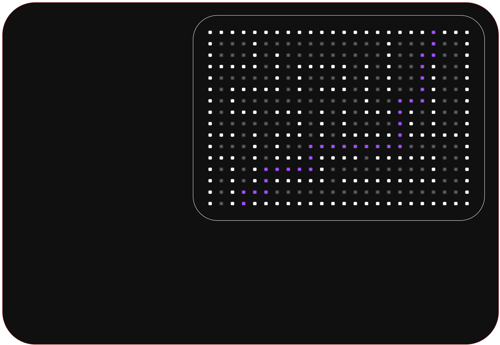
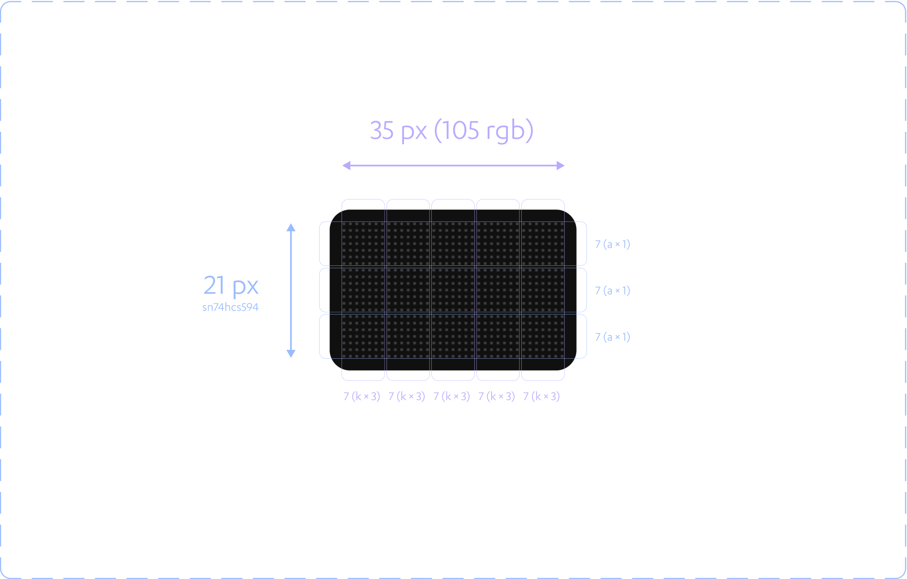

#5e5ce6/projects 

> [!NOTE]  
> This document records any engineering or design considerations surrounding component selection.

---

# Power

- Batteries
	- Want something low-profile, preferably mountable directly to the PCB
		- Coin cells/button batteries, but these are likely to be too low voltage/capacity to drive the LEDs/displays
		- Standard AA(A)/9V?
		- Li-Po batteries?
			- Could get bulky/difficult to charge/less user-friendly (as less common/readily available than alternatives)
	- USB Power Delivery could be the play
		- Will almost definitely be able to provide sufficient power (up to $20\,\text{V}$, $5\,\text{A}$)
		- Gives users the freedom to power from any USB PD supply (which I can reasonably expect them to have)
		- Can be used portably with a USB PD power bank
		- User friendly USB C interface
		- Reverse polarity etc probably isn't needed?
  
# Display

- Need to consider:
	1. Operating voltages;
	2. Typical current draw;
	3. Communication/driving protocol (data lines required, uC peripherals needed); and
	4. Cost.

## Part Number Selection

### Discrete LED Matrix


#### Part Numbers

##### RGBW, Non-Addressable

| Part Number              | `IN-P55QSTGRGBW`                                                                                           | `QLSP08RGBW`                                                                                           | `IN-P55QDTRGBW`                                                                                          | `QBLP679-RGBCW`                                                                                              |
| ------------------------ | ---------------------------------------------------------------------------------------------------------- | ------------------------------------------------------------------------------------------------------ | -------------------------------------------------------------------------------------------------------- | ------------------------------------------------------------------------------------------------------------ |
| Image                    |  |  |  |  |
| Supplier Link            | [DigiKey](https://www.digikey.com/en/products/detail/inolux/IN-P55QSTGRGBW/14555727)                       | [DigiKey](https://www.digikey.com/en/products/detail/quelighting-corp/QLSP08RGBW/15848755)             | [DigiKey](https://www.digikey.com/en/products/detail/inolux/IN-P55QDTRGBW/14555746)                      | [DigiKey](https://www.digikey.com/en/products/detail/qt-brightek-qtb/QBLP679-RGBCW/13278847)                 |
| Colour                   | RGBW                                                                                                       | RGBW                                                                                                   | RGBW                                                                                                     | RGBW                                                                                                         |
| Lens                     | Clear                                                                                                      | Clear                                                                                                  | Clear                                                                                                    | Clear RGB, Diffused W                                                                                        |
| Package/Dimensions       | $5.4\,\text{mm} \times 5\,\text{mm} \times 1.1\,\text{mm}$                                                 | $5\,\text{mm} \times 5\,\text{mm} \times 1.6\,\text{mm}$                                               | $5.5\,\text{mm} \times 5\,\text{mm} \times $1.65\,\text{mm}$                                             | $5\,\text{mm} \times 5\,\text{mm} \times 1.65\,\text{mm}$                                                    |
| Absolute Maximum Voltage | $3.6\,\text{V}$                                                                                            | $3.4\,\text{V}$                                                                                        | $3.6\,\text{V}$                                                                                          | $3.7\,\text{V}$                                                                                              |
| Average Forward Current  | $600\,\text{mA}$                                                                                           | $120\,\text{mA}$                                                                                       | $90\,\text{mA}$                                                                                          | $80\,\text{mA}$                                                                                              |
| Frequency                | -                                                                                                          | -                                                                                                      | -                                                                                                        | -                                                                                                            |
| Driving Method           | Direct connection to A/K                                                                                   | Direct connection to A/K                                                                               | Direct connection to A/K                                                                                 | Direct connection to A/K                                                                                     |
| Data Lines               | $\geq 3$ GPIO pins                                                                                         | $\geq 3$ GPIO pins                                                                                     | $\geq 3$ GPIO pins                                                                                       | $\geq 3$ GPIO pins                                                                                           |
| Cost (for 256)           | USD$138.73                                                                                                 | USD$55.60                                                                                              | USD$77.82                                                                                                | USD$81.05                                                                                                    |
| Remarks                  |                                                                                                            |                                                                                                        |                                                                                                          |                                                                                                              |

> [!success] Preferred Device
> `IN-P55QDTRGBW` is looking the most desirable, `IN-P55QSTGRGBW` is too high power

##### RGB, Non-Addressable

| Part Number              | `CLMVC-FKA-CL1D1L71BB7C3C3`                                                                                                         | `IN-S66TBTRGB`                                                                                        | `IN-P32TATRGB`                                                                                        | `150141M173100`                                                                                         | `IN-S128TATRGB`                                                                                         | `ASMB-LTB2-0A333`                                                                                                    | `ASMB-KTF0-0A306`                                                                                               | `LTST-C19HE1WT`                                                                                                 | `ASMB-TTF0-0A20B`                                                                                           |
| ------------------------ | ----------------------------------------------------------------------------------------------------------------------------------- | ----------------------------------------------------------------------------------------------------- | ----------------------------------------------------------------------------------------------------- | ------------------------------------------------------------------------------------------------------- | ------------------------------------------------------------------------------------------------------- | -------------------------------------------------------------------------------------------------------------------- | --------------------------------------------------------------------------------------------------------------- | --------------------------------------------------------------------------------------------------------------- | ----------------------------------------------------------------------------------------------------------- |
| Image                    |  |  |  |  |  |  |  |  |  |
| Supplier Link            | [DigiKey](https://www.digikey.com/en/products/detail/creeled-inc/CLMVC-FKA-CL1D1L71BB7C3C3/4794065)                                 | [DigiKey]([DigiKey](https://www.digikey.com/en/products/detail/inolux/IN-S66TBTRGB/7604944))          | [DigiKey]([DigiKey](https://www.digikey.com/en/products/detail/inolux/IN-P32TATRGB/7604884))          | [DigiKey](https://www.digikey.com/en/products/detail/w%C3%BCrth-elektronik/150141M173100/4489960)       | [DigiKey](https://www.digikey.com/en/products/detail/inolux/IN-S128TATRGB/7604911)                      | [DigiKey](https://www.digikey.com/en/products/detail/broadcom-limited/ASMB-LTB2-0A333/9740374)                       | [DigiKey](https://www.digikey.com/en/products/detail/broadcom-limited/ASMB-KTF0-0A306/7915692)                  | [DigiKey](https://www.digikey.com/en/products/detail/liteon/LTST-C19HE1WT/3198710)                              | [DigiKey](https://www.digikey.com/en/products/detail/broadcom-limited/ASMB-TTF0-0A20B/7915694)              |
| Colour                   | RGB                                                                                                                                 | RGB                                                                                                   | RGB                                                                                                   | RGB                                                                                                     | RGB                                                                                                     | RGB                                                                                                                  | RGB                                                                                                             | RGB                                                                                                             | RGB                                                                                                         |
| Lens                     | Clear                                                                                                                               | Clear                                                                                                 | Clear                                                                                                 | Clear                                                                                                   | Clear                                                                                                   | Diffused                                                                                                             | Diffused                                                                                                        | Diffused                                                                                                        | Diffused                                                                                                    |
| Package/Dimensions       | $2\,\text{mm} \times 2\,\text{mm} \times 1\,\text{mm}$                                                                              | $1.6\,\text{mm} \times 1.5\,\text{mm} \times 0.55\,\text{mm}$                                         | $3.5\,\text{mm} \times 2.8\,\text{mm} \times 1.9\,\text{mm}$                                          | $3.5\,\text{mm} \times 2.8\,\text{mm} \times 1.9\,\text{mm}$                                            | $3.2\,\text{mm} \times 2.7\,\text{mm} \times 1.1\,\text{mm}$                                            | $2.1\,\text{mm} \times 2.1\,\text{mm} \times 1\,\text{mm}$                                                           | $2.2\,\text{mm} \times 2\,\text{mm} \times 1.9\,\text{mm}$                                                      | $1.6\,\text{mm} \times 1.6\,\text{mm} \times 0.35\,\text{mm}$                                                   | $3.7\,\text{mm} \times 3.5\,\text{mm} \times 2.8\,\text{mm}$                                                |
| Absolute Maximum Voltage | $3.7\,\text{V}$                                                                                                                     | $3.6\,\text{V}$                                                                                       | $3.6\,\text{V}$                                                                                       | $3.6\,\text{V}$                                                                                         | $3.6\,\text{V}$                                                                                         | $3.4\,\text{V}$                                                                                                      | $3.3\,\text{V}$                                                                                                 | $3.9\,\text{V}$                                                                                                 | $3.6\,\text{V}$                                                                                             |
| Average Forward Current  | $51\,\text{mA}$                                                                                                                     | $75\,\text{mA}$                                                                                       | $90\,\text{mA}$                                                                                       | $90\,\text{mA}$                                                                                         | $75\,\text{mA}$                                                                                         | $55\,\text{mA}$                                                                                                      | $60\,\text{mA}$                                                                                                 | $70\,\text{mA}$                                                                                                 | $110\,\text{mA}$                                                                                            |
| Frequency                | -                                                                                                                                   | -                                                                                                     | -                                                                                                     | -                                                                                                       | -                                                                                                       | -                                                                                                                    | -                                                                                                               | -                                                                                                               | -                                                                                                           |
| Configuration            | Common anode                                                                                                                        | Common anode                                                                                          | Common anode                                                                                          | Common anode                                                                                            | Common anode                                                                                            | Common anode                                                                                                         | Common anode                                                                                                    | Common anode                                                                                                    | Direct connection to A/K                                                                                    |
| Data Lines               | $\geq 3$ GPIO pins                                                                                                                  | $\geq 3$ GPIO pins                                                                                    | $\geq 3$ GPIO pins                                                                                    | $\geq 3$ GPIO pins                                                                                      | $\geq 3$ GPIO pins                                                                                      | $\geq 3$ GPIO pins                                                                                                   | $\geq 3$ GPIO pins                                                                                              | $\geq 3$ GPIO pins                                                                                              | $\geq 3$ GPIO pins                                                                                          |
| Cost (for 256)           | USD$50.20                                                                                                                           | USD$41.63                                                                                             | USD$44.60                                                                                             | USD$109.06                                                                                              | USD$47.56                                                                                               | USD$65.05                                                                                                            | USD$41.63                                                                                                       | USD$46.80                                                                                                       | USD$55.91                                                                                                   |
| Remarks                  |                                                                                                                                     |                                                                                                       |                                                                                                       |                                                                                                         |                                                                                                         |                                                                                                                      | Designed specifically for a fine   pitch                                                                        |                                                                                                                 |                                                                                                             |

- For non-addressable LEDs, it will be much more difficult to get a specific colour value as I will need to produce the PWM signals myself—which would likely be incredibly complex for a matrix
	- ie, I will need to produce the PWM signal for the RGB data lines for each of my LEDs at the output of my shift register, if I want to have more than just the base combination of colours
	- This is $3\times n_\text{LEDs}$ bits per row, where $n_\text{LEDs}$ is the number of LEDs in that row
	- I will also need to refresh each row *multiple (many)* times per display state, in order to produce the necessary PWM for each of the RGB data lines
	- This is likely to become impracticable for a large matrix—I would need to refresh each row *multiple (many)* times per display state, in order to produce the necessary PWM for each of the RGB data lines
	- This is likely to become impracticable, as I would need to refresh each row 256 times per frame to produce the typical 16.8 M colours (ie giving each RGB data line a PWM duty cycle of 256 'counts')
	- Thus to drive the display at a reasonable $30\,\text{fps}$, the timing requirements are likely to become quite complex & computationally disruptive (many interrupts very quickly)
	- It would also likely be reasonably complex to implement correctly
	- Would also produce a worse colour output as there is no constant current drive circuity; each RGB data input would require its own current limiting protection resistor, etc
	- Could use an LED driver IC to resolve most of those problems, but DigiKey only stocks ICs with up to 48 outputs—this would correspond to only 16 RGB LEDs per driver, requiring *lots* of drivers for a full matrix—accounting for GPIO pins/routing paths (not to mention cost), this is still not very practicable

> [!todo]
> Actually work through the timing requirements to determine the necessary control frequency

> [!question]
> I'm actually not convinced by this... people have built $8\times 8\times 8 = 512$ RGB LED cubes with non-addressable LEDs, so it must be possible and realistic

- Addressing the hardware concerns—if I employ both shifting (standard shift registers or LED drivers) and multiplexing, I am sure I can significantly cut down on the number of ICs required—it would just increase the complexity of the firmware, but that is fine, provided the clock timing requirements remain reasonable
	- If I want to drive 8 LEDs at once, this requires $8\times 3 = 24\,\text{bits}$ required in the shift register, or 24 channels in the LED driver
	- If I use a 48 channel LED driver, this would correspond to 16 LEDs at once
	- Assuming a matrix of $20\times 16$, this could be one entire column at once
	- I could then use a single driver and multiplex through the columns one at a time
	- This would be very reasonable...
	- With two drivers, I could scan through from Column 0 to Column 9 and Column 10 to Column 19, which I have seen detailed in the datasheets for the Adafruit matrices as providing a smoother visual appearance

##### Addressable

| Part Number             | `601000200`                                                                                         | `IN-PI15TAT5R5G5B`                                                                                             | `IN-PI20TBT5R5G5B`                                                                       | `IN-PI22TAT5R5G5B`                                                                                      | `T3A33BRG-H9C0002X1U1930`                                                                                      | `FZ2812-5050`                                                                                            | `IN-PI554FCH`                                                                                            | `IN-PI55QATPRPGPBPW-40`                                                                                     | `IN-PC55TBTRGB`                                                                                      | `LTST-E263CEGBK`                                                                                          | `19-C47/RSGHBHC-5V01/2T`                                                                                                    | `WS2812B-B/T`                                                                                                   | `DY-S1515065/RGBC/6805-5T`                                                                                                           | `SK6805-EC15`                                                                                                               | `SK6805-EC20`                                                                                                               |
| ----------------------- | --------------------------------------------------------------------------------------------------- | -------------------------------------------------------------------------------------------------------------- | ---------------------------------------------------------------------------------------- | ------------------------------------------------------------------------------------------------------- | -------------------------------------------------------------------------------------------------------------- | -------------------------------------------------------------------------------------------------------- | -------------------------------------------------------------------------------------------------------- | ----------------------------------------------------------------------------------------------------------- | ---------------------------------------------------------------------------------------------------- | --------------------------------------------------------------------------------------------------------- | --------------------------------------------------------------------------------------------------------------------------- | --------------------------------------------------------------------------------------------------------------- | ------------------------------------------------------------------------------------------------------------------------------------ | --------------------------------------------------------------------------------------------------------------------------- | --------------------------------------------------------------------------------------------------------------------------- |
| Image                   |  |  |      |  |  |  |  |  |  |  |  |  |  |  |  |
| Supplier Link           | [DigiKey](https://www.digikey.com/en/products/detail/seeed-technology-co-ltd/601000200/8120706)     | [DigiKey](https://www.digikey.co.nz/en/products/detail/inolux/IN-PI15TAT5R5G5B/14555725)                       | [DigiKey](https://www.digikey.co.nz/en/products/detail/inolux/IN-PI20TBT5R5G5B/14555723) | [DigiKey](https://www.digikey.co.nz/en/products/detail/inolux/IN-PI22TAT5R5G5B/9681237)                 | [DigiKey](https://www.digikey.co.nz/en/products/detail/harvatek-corporation/T3A33BRG-H9C0002X1U1930/15930508)  | [DigiKey](https://www.digikey.co.nz/en/products/detail/feztek/FZ2812-5050/18647407)                      | [DigiKey](https://www.digikey.co.nz/en/products/detail/inolux/IN-PI554FCH/7604874)                       | [DigiKey](https://www.digikey.co.nz/en/products/detail/inolux/IN-PI55QATPRPGPBPW-40/9681240)                | [DigiKey](https://www.digikey.co.nz/en/products/detail/inolux/IN-PC55TBTRGB/9681242)                 | [DigiKey](https://www.digikey.co.nz/en/products/detail/liteon/LTST-E263CEGBK/9556405)                     | [DigiKey](https://www.digikey.co.nz/en/products/detail/everlight-electronics-co-ltd/19-C47-RSGHBHC-5V01-2T/9962978)         | [LCSC](https://www.lcsc.com/product-detail/Light-Emitting-Diodes-LED_Worldsemi-WS2812B-B-T_C2761795.html)       | [LCSC](https://www.lcsc.com/product-detail/Light-Emitting-Diodes-LED_TONYU-DY-S1515065-RGBC-6805-5T_C524053.html)                    | [LCSC](https://www.lcsc.com/product-detail/Light-Emitting-Diodes-LED_OPSCO-Optoelectronics-SK6805-EC15_C2890035.html)       | [LCSC](https://www.lcsc.com/product-detail/Light-Emitting-Diodes-LED_OPSCO-Optoelectronics-SK6805-EC20_C2890036.html)       |
| Colour                  | RGB                                                                                                 | RGB                                                                                                            | RGB                                                                                      | RGB                                                                                                     | RGB                                                                                                            | RGB                                                                                                      | RGB                                                                                                      | RGBW                                                                                                        | RGB                                                                                                  | RGB                                                                                                       | RGB                                                                                                                         | RGB                                                                                                             | RGB                                                                                                                                  | RGB                                                                                                                         | RGB                                                                                                                         |
| Lens                    | Clear                                                                                               | Diffused                                                                                                       | Diffused                                                                                 | Diffused                                                                                                | Clear                                                                                                          | Clear                                                                                                    | Clear                                                                                                    | Diffused                                                                                                    | Diffused                                                                                             | Clear                                                                                                     | Clear                                                                                                                       | Diffused                                                                                                        | Diffused                                                                                                                             | Clear                                                                                                                       | Clear                                                                                                                       |
| Package/Dimensions      | $5.4\,\text{mm} \times 5\,\text{mm} \times 1.65\,\text{mm}$                                         | $1.5\,\text{mm} \times 1.5\,\text{mm} \times 0.65\,\text{mm}$                                                  | $2\,\text{mm} \times 2\,\text{mm} \times 0.65\,\text{mm}$                                | $2.7\,\text{mm} \times 2.4\,\text{mm} \times 1.1\,\text{mm}$                                            | $5.36\,\text{mm} \times 5\,\text{mm} \times 1.6\,\text{mm}$                                                    | $5\,\text{mm} \times 5\,\text{mm} \times 1.6\,\text{mm}$                                                 | $5\,\text{mm} \times 5\,\text{mm} \times 1.6\,\text{mm}$                                                 | $5\,\text{mm} \times 5\,\text{mm} \times 1.6\,\text{mm}$                                                    | $5\,\text{mm} \times 5\,\text{mm} \times 1.6\,\text{mm}$                                             | $1.8\,\text{mm} \times 1.8\,\text{mm} \times 0.65\,\text{mm}$                                             | $1.8\,\text{mm} \times 1.8\,\text{mm} \times 0.65\,\text{mm}$                                                               | $5\,\text{mm} \times 5\,\text{mm} \times 1.6\,\text{mm}$                                                        | $1.5\,\text{mm} \times 1.5\,\text{mm} \times 0.65\,\text{mm}$                                                                        | $1.5\,\text{mm} \times 1.5\,\text{mm} \times 0.65\,\text{mm}$                                                               | $2\,\text{mm} \times 2\,\text{mm} \times 0.65\,\text{mm}$                                                                   |
| Power Supply Voltage    | $3.7 \sim 5.3\,\text{V}$                                                                            | $3.7 \sim 5.5\,\text{V}$                                                                                       | $3.7 \sim 5.5\,\text{V}$                                                                 | $3.5 \sim 5.5\,\text{V}$                                                                                | $3.3 \sim 5.5\,\text{V}$                                                                                       | $3 \sim 7\,\text{V}$                                                                                     | $3.5 \sim 5.5\,\text{V}$                                                                                 | $3.5 \sim 5.5\,\text{V}$                                                                                    | $5 \sim 5.3\,\text{V}$                                                                               | $3.8 \sim 5.5\,\text{V}$                                                                                  | $4.2 \sim 5.5\,\text{V}$                                                                                                    | $3.7 \sim 5.3\,\text{V}$                                                                                        | $3.7 \sim 5.5\,\text{V}$                                                                                                             | $3.7 \sim 5.5\,\text{V}$                                                                                                    | $3.7 \sim 5.5\,\text{V}$                                                                                                    |
| Average Forward Current | $48\,\text{mA}$                                                                                     | $15\,\text{mA}$                                                                                                | $15\,\text{mA}$                                                                          | $15\,\text{mA}$                                                                                         | $30\,\text{mA}$                                                                                                | $25\,\text{mA}$                                                                                          | $36\,\text{mA}$                                                                                          | $36\,\text{mA}$                                                                                             | $60\,\text{mA}$                                                                                      | $19\,\text{mA}$                                                                                           | $15\,\text{mA}$                                                                                                             | $36\,\text{mA}$                                                                                                 | $15\,\text{mA}$                                                                                                                      | $15\,\text{mA}$                                                                                                             | $15\,\text{mA}$                                                                                                             |
| PWM Frequency           | $2\,\text{kHz}$                                                                                     | $1.2\,\text{kHz}$                                                                                              | $1.2\,\text{kHz}$                                                                        | $1.2\,\text{kHz}$                                                                                       |                                                                                                                | $2\,\text{kHz}$                                                                                          | $1.2\,\text{kHz}$                                                                                        | $1.2\,\text{kHz}$                                                                                           | $1.2\,\text{kHz}$                                                                                    |                                                                                                           |                                                                                                                             | $2\,\text{kHz}$                                                                                                 | $1.2\,\text{kHz}$                                                                                                                    | $1.2\,\text{kHz}$                                                                                                           | $1.2\,\text{kHz}$                                                                                                           |
| Data Frequency          | $800\,\text{kHz}$                                                                                   | $800\,\text{kHz}$                                                                                              | $800\,\text{kHz}$                                                                        | $800\,\text{kHz}$                                                                                       | $15\,\text{MHz}$                                                                                               | $800\,\text{kHz}$                                                                                        | $800\,\text{kHz}$                                                                                        | $800\,\text{kHz}$                                                                                           | $30\,\text{MHz}$                                                                                     | $800\,\text{kHz}$                                                                                         |                                                                                                                             | $800\,\text{kHz}$                                                                                               | $800\,\text{kHz}$                                                                                                                    | $800\,\text{kHz}$                                                                                                           | $80\,\text{kHz}$                                                                                                            |
| Protocol                | 24bit serial GRB                                                                                    | 24bit serial GRB                                                                                               | 24bit serial GRB                                                                         | 24bit serial GRB                                                                                        | 32bit serial BRG                                                                                               | 24bit serial GRB                                                                                         | 24bit serial GRB                                                                                         | 32bit serial GRBW                                                                                           | 32bit serial BGR                                                                                     | Unspecified                                                                                               | 24bit serial RGB                                                                                                            | 24bit serial GRB                                                                                                | 24bit serial GRB                                                                                                                     | 24bit serial GRB                                                                                                            | 24bit serial GRB                                                                                                            |
| Data Lines              | $\geq 1$ GPIO pin                                                                                   | 1 GPIO pin                                                                                                     | 1 GPIO pin                                                                               | 1 GPIO pin                                                                                              | 2 GPIO pins                                                                                                    | 1 GPIO pin                                                                                               | 1 GPIO pin                                                                                               | 1 GPIO pin                                                                                                  | 2 GPIO pins                                                                                          | 1 GPIO pin                                                                                                | 1 GPIO pin                                                                                                                  | 1 GPIO pin                                                                                                      | 1 GPIO pin                                                                                                                           | 1 GPIO pin                                                                                                                  | 1 GPIO pin                                                                                                                  |
| Cost (for 256)          | USD$58.37                                                                                           | USD$58.88                                                                                                      | USD$58.88                                                                                | USD$75.06                                                                                               | USD$64.00                                                                                                      | USD$72.27                                                                                                | USD$78.59                                                                                                | USD$78.59                                                                                                   | USD$78.59                                                                                            | USD$98.25                                                                                                 | USD$98.25                                                                                                                   | USD$16.41                                                                                                       | USD$22.41                                                                                                                            | USD$34.92                                                                                                                   | USD$38.22                                                                                                                   |
| Remarks                 | Has internal decoupling capacitor                                                                   |                                                                                                                |                                                                                          |                                                                                                         |                                                                                                                |                                                                                                          |                                                                                                          |                                                                                                             | Two-wire synchronous control                                                                         |                                                                                                           |                                                                                                                             |                                                                                                                 |                                                                                                                                      |                                                                                                                             |                                                                                                                             |

> [!summary] Preferred Devices
> I would prefer the black `WS2812B-B/T` from LCSC over any of the white offerings from DigiKey due to colour/price considerations, *except* for possibly the `IN-PI15TAT5R5G5B` or the larger `IN-PI20TBT5R5G5B`—the price difference here isn't *that* extreme (compared to the comparable LCSC devices), and I would prefer to order from DigiKey due to shipping/order consolidation reasons. Also, the DigiKey devices are diffused, and the datasheets are in English.

> [!fail]
> But, I would actually prefer the all-black & black diffused LEDs that are available in a common anode configuration... these are also *considerably* cheaper from LCSC, eg USD\$3 vs USD\$30 for 256.
> Also, individually addressable LEDs might be *too easy*... in the sense that they might be a bit too straight-forward to drive, making this project too easy.
> Also, it'd mean that the board is effectively just the uC + LEDs + power, without needing anything other ICs for the matrix... I kind of want something more involved.
> I'll compare some more common anode/cathode RGB LEDs in the physical packages I'm after, and see if I can figure out a nice way to drive them all.

##### RGB, Non-Addressable (continued)

| Part Number              | `NH-B1212RGBA-HF`                                                                                                                               | `NH-B1515RGBA-HF`                                                                                                                               | `NH-B2020RGBA-HF`                                                                                                                               | `RS-1515MBAM`                                                                                                                          | `MHPA2121URGBDT`                                                                                                  | `ASCB-JTC2-0A308`                                                                                 |
| ------------------------ | ----------------------------------------------------------------------------------------------------------------------------------------------- | ----------------------------------------------------------------------------------------------------------------------------------------------- | ----------------------------------------------------------------------------------------------------------------------------------------------- | -------------------------------------------------------------------------------------------------------------------------------------- | ----------------------------------------------------------------------------------------------------------------- | ------------------------------------------------------------------------------------------------- |
| Image                    |  |  |  |  |  |  |
| Supplier Link            | [LCSC](https://www.lcsc.com/product-detail/Light-Emitting-Diodes-LED_Foshan-NationStar-Optoelectronics-NH-B1212RGBA-HF_C2874114.html)           | [LCSC](https://www.lcsc.com/product-detail/Light-Emitting-Diodes-LED_Foshan-NationStar-Optoelectronics-NH-B1515RGBA-HF_C2874115.html)           | [LCSC](https://www.lcsc.com/product-detail/Light-Emitting-Diodes-LED_Foshan-NationStar-Optoelectronics-NH-B2020RGBA-HF_C2874116.html)           | [LCSC](https://www.lcsc.com/product-detail/Light-Emitting-Diodes-LED_Foshan-NationStar-Optoelectronics-RS-1515MBAM_C727906.html)       | [LCSC](https://www.lcsc.com/product-detail/Light-Emitting-Diodes-LED_MEIHUA-MHPA2121URGBDT_C404284.html)          | [DigiKey](https://www.digikey.com/en/products/detail/broadcom-limited/ASCB-JTC2-0A308/15181480)   |
| Colour                   | RGB                                                                                                                                             | RGB                                                                                                                                             | RGB                                                                                                                                             | RGB                                                                                                                                    | RGB                                                                                                               | RGB                                                                                               |
| Lens                     | Diffused square                                                                                                                                 | Diffused square                                                                                                                                 | Diffused circle                                                                                                                                 | Diffused square                                                                                                                        | Diffused circle                                                                                                   | Diffused square                                                                                   |
| Package/Dimensions       | $1.23\,\text{mm} \times 1.2\,\text{mm} \times 0.9\,\text{mm}$                                                                                   | $1.6\,\text{mm} \times 1.5\,\text{mm} \times 1\,\text{mm}$                                                                                      | $2.1\,\text{mm} \times 2.1\,\text{mm} \times 1\,\text{mm}$                                                                                      | $1.6\,\text{mm} \times 1.5\,\text{mm} \times 1\,\text{mm}$                                                                             | $2.1\,\text{mm} \times 2.1\,\text{mm} \times 1\,\text{mm}$                                                        | $1.6\,\text{mm} \times 1.5\,\text{mm} \times 1\,\text{mm}$                                        |
| Absolute Maximum Voltage | $3.2\,\text{V}$                                                                                                                                 | $3.2\,\text{V}$                                                                                                                                 | $3.2\,\text{V}$                                                                                                                                 | $3.4\,\text{V}$                                                                                                                        | $3.1\,\text{V}$                                                                                                   | $3.1\,\text{V}$                                                                                   |
| Average Forward Current  | $60\,\text{mA}$                                                                                                                                 | $60\,\text{mA}$                                                                                                                                 | $60\,\text{mA}$                                                                                                                                 | $50\,\text{mA}$                                                                                                                        | $65\,\text{mA}$                                                                                                   | $46\,\text{mA}$                                                                                   |
| Configuration            | Common anode                                                                                                                                    | Common anode                                                                                                                                    | Common anode                                                                                                                                    | Common anode                                                                                                                           | Common anode                                                                                                      | Common anode                                                                                      |
| Data Lines               | $\geq 3$ GPIO pins                                                                                                                              | $\geq 3$ GPIO pins                                                                                                                              | $\geq 3$ GPIO pins                                                                                                                              | $\geq 3$ GPIO pins                                                                                                                     | $\geq 3$ GPIO pins                                                                                                | $\geq 3$ GPIO pins                                                                                |
| Cost (for 256)           | USD2.44                                                                                                                                         | USD$1.98                                                                                                                                        | USD$1.98                                                                                                                                        | USD$4.47                                                                                                                               | USD$15.76                                                                                                         | USD$71.71                                                                                         |
| Remarks                  |                                                                                                                                                 |                                                                                                                                                 |                                                                                                                                                 |                                                                                                                                        |                                                                                                                   |                                                                                                   |

#### Pros

- Likely the simplest to implement in hardware/firmware (without external libraries)
- Can easily understand/communicate how it works
- Would have the prettiest RGB rainbow animations
- Largest physical size
- Can implement from scratch myself, without needing to buy a module

#### Cons
- Lots of individual LEDs for a medium-large matrix...
- Cost?
- Power draw—unsure of how power-hungry the other options are, but I expect this to be more power-hungry than a off-the-shelf display module
- Far inferior pixel density/resolution
- Heat dissipation—may require me to produce my *own* LED matrix module on an aluminium board—at which point I might want to just buy a commercial product?

### LED Matrix Module/Panel


| Part Number       | `Adafruit 420`                                                      | `Adafruit 607`                                                      |
| ----------------- | ------------------------------------------------------------------- | ------------------------------------------------------------------- |
| Image             |  |  |
| Supplier Link     | [Adafruit](https://www.adafruit.com/product/420)                    | [Adafruit](https://www.adafruit.com/product/607)                    |
| LED part          | `SMD3528`                                                           |                                                                     |
| Resolution        | 512 LEDs, $16\times 32$ matrix                                      | 1024 LEDs, $32\times 32$ matrix                                     |
| Dimensions        | $192\,\text{mm} \times 96\,\text{mm} \times 12\,\text{mm}$          | $128\,\text{mm} \times 128\,\text{mm} \times 17\,\text{mm}$         |
| Operating Voltage | Regulated $5\,\text{V}$                                             | Regulated $5\,\text{V}$                                             |
| Max Current Draw  | $2.5\,\text{A}$                                                     | $4\,\text{A}$                                                       |
| Driving Method    | $1/8$ scan, $50\sim60\,\text{Hz}$                                   | $1/16$ scan                                                         |
| Data Lines        | 13 GPIO pins                                                        | 13 GPIO pins                                                        |
| Cost              | USD$24.95                                                           | USD$29.95                                                           |
| Remarks           |                                                                     |                                                                     |

#### Pros

- Primarily the same as that for a custom-built LED matrix with discrete LEDs
- Probably cheaper than building it myself

#### Cons
- Don't get to do the design/layout myself

### Dot Matrix Module


| Part Number       | `TS0230`                                                                                       |
| ----------------- | ---------------------------------------------------------------------------------------------- |
| Image             |  |
| Supplier Link     | [DigiKey](https://www.digikey.com/en/products/detail/sunfounder/TS0230/16612468)               |
| LED part          | -                                                                                              |
| Resolution        | 64 LEDs, $8\times 8$ matrix                                                                    |
| Dimensions        | $80\,\text{mm} \times 70\,\text{mm} \times 25\,\text{mm}$                                      |
| Operating Voltage | $5\,\text{V}$                                                                                  |
| Max Current Draw  | Unknown                                                                                        |
| Driving Method    | I2C                                                                                            |
| Data Lines        | Unknown, necessarily $\geq 2$                                                                  |
| Cost              | USD$26.85                                                                                      |
| Remarks           | No datasheet                                                                                   |

#### Pros

- Can daisy chain together
- Is a developed module—less need for heat considerations etc
- No need to implement own driver circuitry

#### Cons

- Effectively the same as buying a standard LED matrix
- Larger physical footprint
- Likely more expensive than buying the LEDs myself

### LCD Module


#### Pros

- Cheap

#### Cons

- Can only easily display letters
- Must fit to each segment—would not work for the maze/logo
- Single colour

### OLED Module


#### Pros

- Less power draw
- Lighter, thinner
- Higher resolution/pixel density

#### Cons

- Small—hard to read
- Can get expensive for larger screens/higher resolutions
- Doesn't look very good, in my opinion

### TFT Display


#### Pros

- Highest resolution?
- Easier to get in larger sizes than OLED modules
- More cost effective

#### Cons

- Scope creep?
- Small physical size
- Not as 'interesting' as an LED matrix?
- Requires a backlight—higher power draw

## Layout Design

> [!todo] Requirements
> - [x] Minimum resolution of $20\times 15$

### Selected Devices

#### Addressable LEDs

If I choose to go with addressable LEDs, I would select the [`WS2812B-B/T`](https://www.lcsc.com/product-detail/Light-Emitting-Diodes-LED_Worldsemi-WS2812B-B-T_C2761795.html) for price and solderability.

#### Non-Addressable LEDs

If I choose to go with non-addressable LEDs, I would select:
1. [`RS-1515MBAM`](https://www.lcsc.com/product-detail/Light-Emitting-Diodes-LED_Foshan-NationStar-Optoelectronics-RS-1515MBAM_C727906.html), for price, lens, and forward current.
2. [`NH-B1515RGBA-HF`](https://www.lcsc.com/product-detail/Light-Emitting-Diodes-LED_Foshan-NationStar-Optoelectronics-NH-B1515RGBA-HF_C2874115.html) as it is pin compatible.
3. [`ASCB-JTC2-0A308`](https://www.digikey.com/en/products/detail/broadcom-limited/ASCB-JTC2-0A308/15181480) as it is pin compatible.
4. [`CLMVC-FKA-CL1D1L71BB7C3C3`](https://www.digikey.com/en/products/detail/creeled-inc/CLMVC-FKA-CL1D1L71BB7C3C3/4794065).

- Assuming I select the $1.6\,\text{mm}\times 1.5\,\text{mm}$ devices and a pitch of $3\,\text{mm}$, this produces a $24\times 16=384$ matrix that looks like the following:
	1. 
	2. 
	3. 

- I learn that, although I can double up for an even maze, I would need many more pixels (and similarly matrix size) to have enough paths
- I do notice however that the odd maze is quite hard to read, perhaps a smaller pitch will make this better
- I will plan on moving forward with a single-pixel line width, and design for an odd-dimensioned matrix such that gaps work out as desired

- With a pitch of $2.5\,\text{mm}$, I have a $27\times 15=405$ matrix that produces
	1. 
	2. 
	3. 
 
- This definitely looks better, but I think the maze could/should still be more readable than what it is
- I chose to keep the row count to $15$, as this allows me to to use a single 48-channel LED driver to drive a whole $\frac{48}{3}=16$ LED column at once, where I can then multiplex through
- As these are not addressable LEDs (ie incorporate a controller within the LED device), they do not require local decoupling—so I do not need to account for this in designing the pitch

- Reducing the pitch to $1.6\,\text{mm}$, I have a $35\times21=735$ matrix
	1. 
	2. 
	3. 
 
 - I am happy with this, I think this pitch is a good balance between being realistic (assembly, pixel count—price), and being readable with a decent resolution
 - The row/column counts of 21 and 35 have also been deliberately chosen as I can use three 36-channel (ie 12 RGB LED) drivers to drive the full row, or two 36-channel drivers to drive a full column

 - In terms of the driving mechanism, my first idea would be to use the below topology, with three 36-channel drivers to drive all the columns at once, and scan through the 21 rows with a set of three 8-bit shift registers chained together
	 - 

- My next step will be to part out the LED drivers and shift registers that I want to use
- A potential improvement (scan-wise) would be to add three more drivers such that I can split the rows in half, and display two whole rows at once (ie scanning through two lines at once), which would improve the refresh/scan rate of the display, at a cost of component count/cost/driver frequency

- As I am just wanting to scan through the rows one after another and do not need to load some arbitrary data into the shift register before enabling the output all at once, I will not need an output storage register
	- I can simply write the next bit into the shift register once I am ready to scan to the next row, as I only expect the shift register to contain a single `1` at any given instant
 - I also do not need a tri-state output, as the shift register output will be the only thing connected to the common anode pins (probably through a buffer transistor)

- From the LED driver perspective—I may want to use more drivers simply such that each driver is controlling less than 32 channels, so that I can represent it using a `uint32_t` rather than needing to use a whole `uint64_t` and wasting 28 bits (for a total of 87 wasted bits)
```c
#define DISPLAY_TOTAL_ROWS 35  
#define DISPLAY_TOTAL_COLUMNS 21  
#define DISPLAY_PIXEL_TOTAL_CHANNELS 3  
  
typedef uint128_t row_t;  
typedef uint32_t column_t;  
  
#define DISPLAY_DRIVER_TOTAL_ONE 12 * DISPLAY_PIXEL_TOTAL_CHANNELS  
#define DISPLAY_DRIVER_TOTAL_TWO 11 * DISPLAY_PIXEL_TOTAL_CHANNELS  
#define DISPLAY_DRIVER_TOTAL_THREE 12 * DISPLAY_PIXEL_TOTAL_CHANNELS  
  
typedef uint64_t driver_t; // !
  
row_t currentRow = 0b010/* ... */001;  
  
driver_t driverOne = (currentRow <<= DISPLAY_DRIVER_TOTAL_ONE);  
driver_t driverTwo = (currentRow <<= DISPLAY_DRIVER_TOTAL_TWO);  
driver_t driverThree = (currentRow <<= DISPLAY_DRIVER_TOTAL_THREE);
```
- Another option I have is to reduce the column count from 35 to 31, producing a more square matrix
	- 
	- I'm not sure how I feel about this, I think I will pursue the alternative of simply using more drivers for the time being
	- This may work out to be the better decision regardless, as I would expect 24-channel drivers to be easier to source than 48-channel drivers
	- Furthermore, a quick cursory search on DigiKey suggests that 24-channel drivers can be found that sink significantly more ($60\,\text{mA}$ vs $30\,\text{mA}$) current than 48-channel drivers
	- Also, although I can find 36-channel drivers, I can only find them in quad flat packages (and with less current capability), whilst I'd prefer a SOP package for routing/aesthetics
	
##### Shift Registers

| Part Number             | `SN74HCS264PWR`                                                                                                | `SN74HCS264DR`                                                                                               | `SN74HCS595PWR`                                                                                                | `74VHC9164FT`                                                                                                  | `SN74HCS594PWR`                                                                                                | `SN74HCS594DYYR`                                                                                               | `SN74HCS596PWR`                                                                                                | `74VHC164FT`                                                                                                  | `SN74HC164PWR`                                                                                                |
| ----------------------- | -------------------------------------------------------------------------------------------------------------- | ------------------------------------------------------------------------------------------------------------ | -------------------------------------------------------------------------------------------------------------- | -------------------------------------------------------------------------------------------------------------- | -------------------------------------------------------------------------------------------------------------- | -------------------------------------------------------------------------------------------------------------- | -------------------------------------------------------------------------------------------------------------- | ------------------------------------------------------------------------------------------------------------- | ------------------------------------------------------------------------------------------------------------- |
| Image                   |  |  |  |   |  |  |  |                |  |
| Supplier Link           | [DigiKey](https://www.digikey.com.au/en/products/detail/texas-instruments/SN74HCS264PWR/13532299)              | [DigiKey](https://www.digikey.com.au/en/products/detail/texas-instruments/SN74HCS264DR/13562988)             | [DigiKey](https://www.digikey.com.au/en/products/detail/texas-instruments/SN74HCS595PWR/13532278)              | [DigiKey](https://www.digikey.com.au/en/products/detail/toshiba-semiconductor-and-storage/74VHC9164FT/9866007) | [DigiKey](https://www.digikey.com.au/en/products/detail/texas-instruments/SN74HCS594PWR/13532304)              | [DigiKey](https://www.digikey.com.au/en/products/detail/texas-instruments/SN74HCS594DYYR/14641442)             | [DigiKey](https://www.digikey.com.au/en/products/detail/texas-instruments/SN74HCS596PWR/13532316)              | [DigiKey](https://www.digikey.com.au/en/products/detail/toshiba-semiconductor-and-storage/74VHC164FT/5019930) | [DigiKey](https://www.digikey.com.au/en/products/detail/texas-instruments/SN74HC164PWR/522546)                |
| Pins                    | 14                                                                                                             | 14                                                                                                           | 16                                                                                                             | 16                                                                                                             | 16                                                                                                             | 16                                                                                                             | 16                                                                                                             | 14                                                                                                            | 14                                                                                                            |
| Package                 | `14-TSSOP`                                                                                                     | `14-SOIC`                                                                                                    | `16-TSSOP`                                                                                                     | `16-TSSOP`                                                                                                     | `16-TSSOP`                                                                                                     | `16-SOIC`                                                                                                      | `16-TSSOP`                                                                                                     | `14-TSSOP`                                                                                                    | `14-TSSOP`                                                                                                    |
| Pin Pitch               | $0.65\,\text{mm}$                                                                                              | $1.27\,\text{mm}$                                                                                            | $0.65\,\text{mm}$                                                                                              | $0.65\,\text{mm}$                                                                                              | $0.65\,\text{mm}$                                                                                              | $1.27\,\text{mm}$                                                                                              | $0.65\,\text{mm}$                                                                                              | $0.65\,\text{mm}$                                                                                             | $0.65\,\text{mm}$                                                                                             |
| Bits                    | 8                                                                                                              | 8                                                                                                            | 8                                                                                                              | 8                                                                                                              | 8                                                                                                              | 8                                                                                                              | 8                                                                                                              | 8                                                                                                             | 8                                                                                                             |
| Input Enable            | Yes                                                                                                            | Yes                                                                                                          | No                                                                                                             | No                                                                                                             | No                                                                                                             | No                                                                                                             | No                                                                                                             | Yes                                                                                                           | Yes                                                                                                           |
| Schmitt Inputs          | Yes                                                                                                            | Yes                                                                                                          | Yes                                                                                                            | Yes                                                                                                            | Yes                                                                                                            | Yes                                                                                                            | Yes                                                                                                            | No                                                                                                            | No                                                                                                            |
| Output Enable           | No                                                                                                             | No                                                                                                           | Yes                                                                                                            | No                                                                                                             | No                                                                                                             | No                                                                                                             | Yes                                                                                                            | No                                                                                                            | No                                                                                                            |
| Inverted Outputs        | Yes                                                                                                            | Yes                                                                                                          | No                                                                                                             | No                                                                                                             | No                                                                                                             | No                                                                                                             | No                                                                                                             | No                                                                                                            | No                                                                                                            |
| Output Storage Register | No                                                                                                             | No                                                                                                           | Yes                                                                                                            | No                                                                                                             | Yes                                                                                                            | Yes                                                                                                            | Yes                                                                                                            | No                                                                                                            | No                                                                                                            |
| Output                  | Push-pull                                                                                                      | Push-pull                                                                                                    | Tri-state                                                                                                      | Push-pull                                                                                                      | Push-pull                                                                                                      | Push-pull                                                                                                      | Open-drain                                                                                                     | Push-pull                                                                                                     | Push-pull                                                                                                     |
| Function                | S to P                                                                                                         | S to P                                                                                                       | S to P                                                                                                         | S to P, P to S                                                                                                 | S to P                                                                                                         | S to P                                                                                                         | S to P                                                                                                         | S to P                                                                                                        | S to P                                                                                                        |
| Voltage                 | $2 \sim 6\,\text{V}$                                                                                           | $2 \sim 6\,\text{V}$                                                                                         | $2 \sim 6\,\text{V}$                                                                                           | $2 \sim 5.5\,\text{V}$                                                                                         | $2 \sim 6\,\text{V}$                                                                                           | $2 \sim 6\,\text{V}$                                                                                           | $2 \sim 6\,\text{V}$                                                                                           | $2 \sim 5.5\,\text{V}$                                                                                        | $2 \sim 6\,\text{V}$                                                                                          |
| Max Current             | $35\,\text{mA}$                                                                                                | $35\,\text{mA}$                                                                                              | $35\,\text{mA}$                                                                                                | $25\,\text{mA}$                                                                                                | $35\,\text{mA}$                                                                                                | $35\,\text{mA}$                                                                                                | $35\,\text{mA}$                                                                                                | $25\,\text{mA}$                                                                                               | $25\,\text{mA}$                                                                                               |
| Max Frequency           | $68\,\text{MHz}$                                                                                               | $68\,\text{MHz}$                                                                                             | $110\,\text{MHz}$                                                                                              | $149\,\text{MHz}$                                                                                              | $100\,\text{MHz}$                                                                                              | $100\,\text{MHz}$                                                                                              | $110\,\text{MHz}$                                                                                              | $115\,\text{MHz}$                                                                                             | $54\,\text{MHz}$                                                                                              |
| Clock Edge              | Rising                                                                                                         | Rising                                                                                                       | Rising                                                                                                         | Rising                                                                                                         | Rising                                                                                                         | Rising                                                                                                         | Rising                                                                                                         | Rising                                                                                                        | Rising                                                                                                        |
| Cost (for 3)            | USD$1.08                                                                                                       | USD$1.08                                                                                                     | USD$1.11                                                                                                       | USD$1.20                                                                                                       | USD$1.29                                                                                                       | USD$1.41                                                                                                       | USD$1.29                                                                                                       | USD$1.32                                                                                                      | USD$1.56                                                                                                      |
| Remarks                 | Inverted output so cannot naively chain                                                                        | Inverted output so cannot naively chain                                                                      |                                                                                                                |                                                                                                                | Best so far                                                                                                    |                                                                                                                |                                                                                                                |                                                                                                               |                                                                                                               |

> [!success] Preferred Device
> The best device seems to be the [`SN74HCS594PWR`](https://www.digikey.com.au/en/products/detail/texas-instruments/SN74HCS594PWR/13532304) with its shift & storage clocks tied together—so I will move forward with this

- Adding two extra LED drivers, I realise I can improve the distribution per IC to be 7 columns per 24-channel LED driver, and 7 rows per shift register—this gives me an even distribution per IC
	 - 
	 - This *may* make the shift registers more difficult to arrange (at least with an output register), as I cannot directly chain them together without skipping a row (due to the 8th bit not being used)
	 - This should just be a case of connecting one of the earlier parallel outputs to the input of the next shift register, but I will just need to follow the timing/clock cycles detailed in the datasheet
	 - This topology has an advantage of a better distribution of current per IC, making it easier to stay below the current limits
	 - This topology still wastes bits (55 bits), but this is better than the 87 bits of the previous arrangement—it also uses a 32 bit integer instead of a 64 bit integer, which would be preferred if the microcontroller I use has a core width of 32 bits

##### LED Drivers

  - For my LED drivers, I probably want a shift register topology so that I can drive them all from a single data line
> [!warning]
> I need to be careful as I am only using 21 channels per driver, such that the extra 3 channels must be don't-cares when shifting the data

- Also, if most SOP/QFP ICs still require/encourage the thermal solder pad to be soldered for heatsinking, I might as well consider a QFN/other no-lead package—as I will be unable to iron-solder in either case

- If the LED driver is handling all the power/brightness control, all my micro will need to do is write the information for the next row to the drivers, latch them, multiplex to the row, and wait until the next scan cycle before repeating
- This should be fairly straightforward?

| Part Number               | `TLC5955DCAR`                                                                                                 | `STP24DP05BTR`                                                                                                      | `LED2472GBTR`                                                                                                      | `TLC6C5724QDAPRQ1`                                                                                                 | `PCA9956BTWY`                                                                                              | `TLC5947DAPR`                                                                                                   | `TLC5951DAP`                                                                                                 | `TLC5952DAP`                                                                                                   |
| ------------------------- | ------------------------------------------------------------------------------------------------------------- | ------------------------------------------------------------------------------------------------------------------- | ------------------------------------------------------------------------------------------------------------------ | ------------------------------------------------------------------------------------------------------------------ | ---------------------------------------------------------------------------------------------------------- | --------------------------------------------------------------------------------------------------------------- | ------------------------------------------------------------------------------------------------------------ | -------------------------------------------------------------------------------------------------------------- |
| Image                     |  |  |  |  |  |  |  |  |
| Supplier Link             | [DigiKey](https://www.digikey.co.nz/en/products/detail/texas-instruments/TLC5955DCAR/5181329)                 | [DigiKey](https://www.digikey.co.nz/en/products/detail/stmicroelectronics/STP24DP05BTR/1917117)                     | [DigiKey](https://www.digikey.co.nz/en/products/detail/stmicroelectronics/LED2472GBTR/4506353)                     | [DigiKey](https://www.digikey.co.nz/en/products/detail/texas-instruments/TLC6C5724QDAPRQ1/9608023)                 | [DigiKey](https://www.digikey.co.nz/en/products/detail/nxp-usa-inc/PCA9956BTWY/5361188)                    | [DigiKey](https://www.digikey.co.nz/en/products/detail/texas-instruments/TLC5947DAPR/2047743)                   | [DigiKey](https://www.digikey.co.nz/en/products/detail/texas-instruments/TLC5951DAP/2187574)                 | [DigiKey](https://www.digikey.co.nz/en/products/detail/texas-instruments/TLC5952DAP/2078405)                   |
| Input Pins                | 4                                                                                                             | 6                                                                                                                   | 4                                                                                                                  | 8                                                                                                                  | 8                                                                                                          | 5                                                                                                               | 10                                                                                                           | 5                                                                                                              |
| Package                   | `56-HTSSOP`                                                                                                   | `48-TQFP`                                                                                                           | `48-TQFP`                                                                                                          | `38-HTSSOP`                                                                                                        | `38-HTSSOP`                                                                                                | `32-HTSSOP`                                                                                                     | `38-HTSSOP`                                                                                                  | `32-HTSSOP`                                                                                                    |
| Pin Pitch                 | $0.5\,\text{mm}$                                                                                              | $0.5\,\text{mm}$                                                                                                    | $0.5\,\text{mm}$                                                                                                   | $0.65\,\text{mm}$                                                                                                  | $0.5\,\text{mm}$                                                                                           | $0.65\,\text{mm}$                                                                                               | $0.65\,\text{mm}$                                                                                            | $0.65\,\text{mm}$                                                                                              |
| Channels                  | 48                                                                                                            | 24                                                                                                                  | 24                                                                                                                 | 24                                                                                                                 | 24                                                                                                         | 24                                                                                                              | 24                                                                                                           | 24                                                                                                             |
| Protocol                  | Shift register                                                                                                | Shift register                                                                                                      | Shift register                                                                                                     | Shift register                                                                                                     | I2C                                                                                                        | Shift register                                                                                                  | Shift register                                                                                               | Shift register                                                                                                 |
| Dimming                   | Analogue global, PWM greyscale                                                                                | Output enable pins                                                                                                  | Output enable pins                                                                                                 | Analogue group, PWM greyscale                                                                                      | PWM greyscale, output enable pin                                                                           | PWM greyscale                                                                                                   | Analogue global, PWM greyscale                                                                               | Analogue global                                                                                                |
| Greyscale Resolution      | 16 bit                                                                                                        | -                                                                                                                   | 6 bit and external resistor                                                                                        | 12 bit                                                                                                             | 8 bit                                                                                                      | 12 bit                                                                                                          | 12 bit                                                                                                       | -                                                                                                              |
| Global Brightness Control | 7 bit                                                                                                         | External resistors                                                                                                  | External resistors                                                                                                 | 8 bit per group, external   resistors                                                                              | 8 bit                                                                                                      | External resistors                                                                                              | 8 bit, external resistors                                                                                    | 7 bit                                                                                                          |
| Voltage                   | $3\sim5.5\,\text{V}$                                                                                          | $3\sim5.5\,\text{V}$                                                                                                | $3\sim5.5\,\text{V}$                                                                                               | $3\sim5.5\,\text{V}$                                                                                               | $3\sim5.5\,\text{V}$                                                                                       | $3\sim5.5\,\text{V}$                                                                                            | $3\sim5.5\,\text{V}$                                                                                         | $3\sim5.5\,\text{V}$                                                                                           |
| Max Current per Channel   | $31.9\,\text{mA}$                                                                                             | $80\,\text{mA}$                                                                                                     | $72\,\text{mA}$                                                                                                    | $50\,\text{mA}$                                                                                                    | $57\,\text{mA}$                                                                                            | $30\,\text{mA}$                                                                                                 | $40\,\text{mA}$                                                                                              | $35\,\text{mA}$ RG, $26.2\,\text{mA}$ B                                                                        |
| Max GND Current           |                                                                                                               | $2\,\text{A}$                                                                                                       | $1.9\,\text{A}$                                                                                                    |                                                                                                                    | $2.5\,\text{A}$                                                                                            |                                                                                                                 |                                                                                                              |                                                                                                                |
| Max Frequency             | $25\,\text{MHz}$                                                                                              | $25\,\text{MHz}$                                                                                                    | $30\,\text{MHz}$                                                                                                   | $4\,\text{MHz}$                                                                                                    | $1\,\text{MHz}$                                                                                            | $15\,\text{MHz}$ cascaded                                                                                       | $30\,\text{MHz}$                                                                                             | $35\,\text{MHz}$                                                                                               |
| Cost (for 5)              | USD$29.90                                                                                                     | USD$15.60                                                                                                           | USD$15.80                                                                                                          | USD$17.65                                                                                                          | USD$18.40                                                                                                  | USD$19.45                                                                                                       | USD$21.90                                                                                                    |                                                                                                                |
| Remarks                   |                                                                                                               |                                                                                                                     |                                                                                                                    | Automotive                                                                                                         | Has internal oscillator                                                                                    | Has internal oscillator                                                                                         | Best so far                                                                                                  |                                                                                                                |

> [!success] Preferred Device
> The best device seems to be the [`TLC5951DAP`](https://www.digikey.co.nz/en/products/detail/texas-instruments/TLC5951DAP/2187574) due to its maximum output current and brightness/dimming controls/data frequency. If I find that $4\,\text{MHz}$ is sufficient for my data frequency, the [`TLC6C5724QDAPRQ1`](https://www.digikey.co.nz/en/products/detail/texas-instruments/TLC6C5724QDAPRQ1/9608023) may be the better choice.

> [!todo] Schematic Note
> - [ ] Have an extra NF resistor for `IREF` in case I want to decrease the current limit (ie have lower brightnesses)

- These selections give me the following matrix layout:
	 - 
